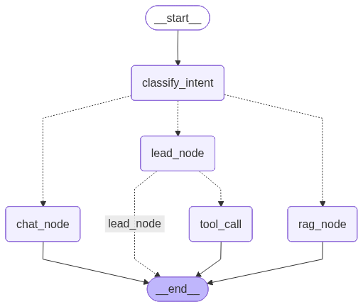

# Lead Collecting Agent
# WATCH DEMO👇



#### classify_intent 
This node classify the current intent of the user by analysing his/her last 6 messages.
It classifies in only three intent:
1. greetings
2. inquiry
3. high_intent

#### rag_node
This node handles the conversation when any specific info is demanded by the user such as plan and policies info. 
It retrieves the semantic similar infor from the knowledge base and frames its response.

#### chat_node
This node handles the conversation when casual greetings and chatting is going on.

#### lead_node
This node handles the collection of information from the user such as name, email, platform.
It routes to the tool_call only if all the informations are collected.

#### tool_call 
This node calls the mock_capture_lead tool.

This project is now organized as a small Python package under `lead_agent`.

## Structure

- `lead_agent/`
  - `graph.py`: builds and compiles the LangGraph chatbot flow
  - `nodes.py`: intent classification, RAG, chat, and lead capture node handlers
  - `rag.py`: document indexing and retriever setup
  - `llm.py`: LLM initialization and environment validation
  - `tools.py`: mock lead capture tool
  - `config.py`: environment constants and configuration helpers
  - `utils.py`: persistence helpers for SQLite checkpointing
  - `prompt.py`: the assistant system prompt

- `streamlit_app.py`: Streamlit UI entrypoint using the package
- `requirements.txt`: dependency list

## Usage

1. Create a `.env` with `GOOGLE_API_KEY` set.
2. Install dependencies:
   ```bash
   pip install -r requirements.txt
   ```
3. Run the Streamlit UI:
   ```bash
   streamlit run streamlit_app.py
   ```

## Improvements

- Centralized logging with `logging`
- Stronger configuration and environment validation
- Clear module boundaries for agent logic, RAG retrieval, and prompt setup
- Root entrypoints now import from `lead_agent`
"# LeadCaptureAIAgent" 
